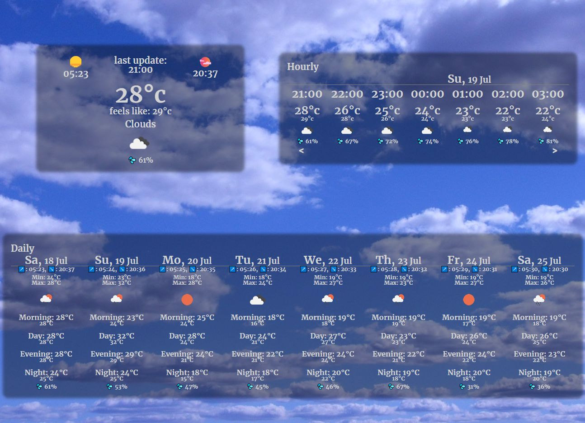
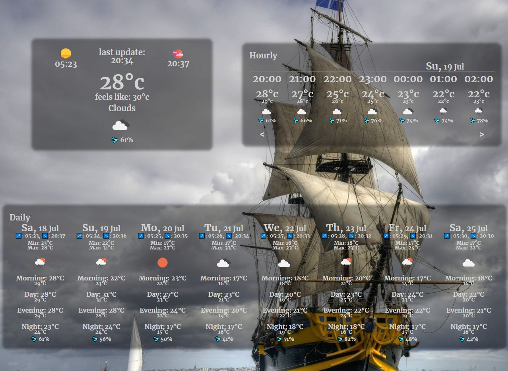
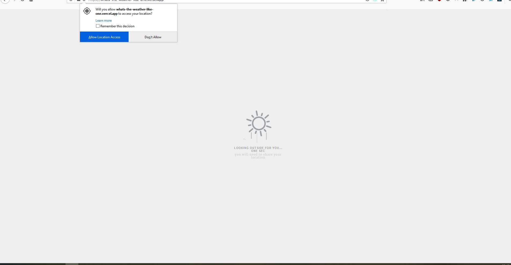
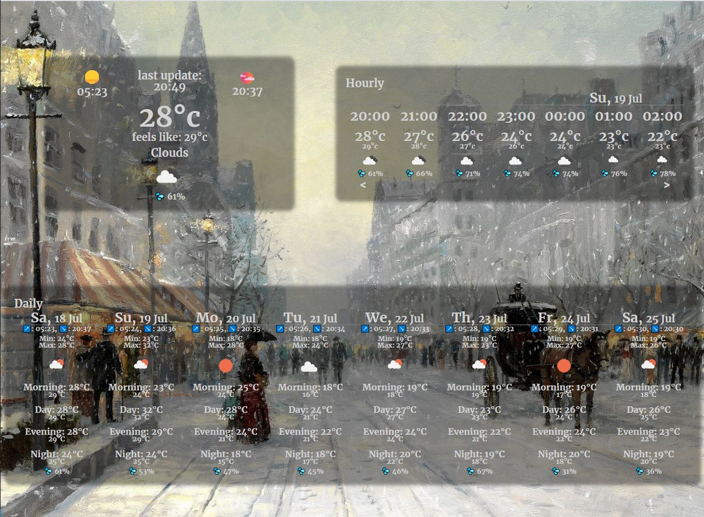
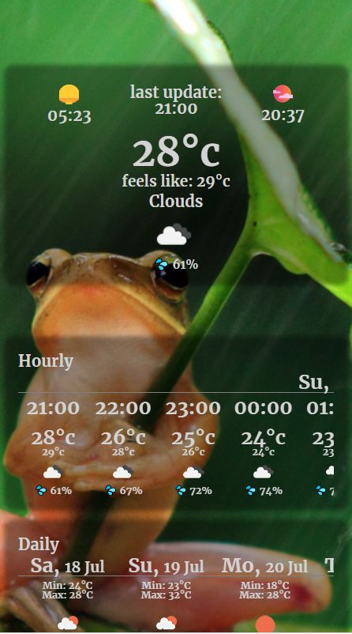
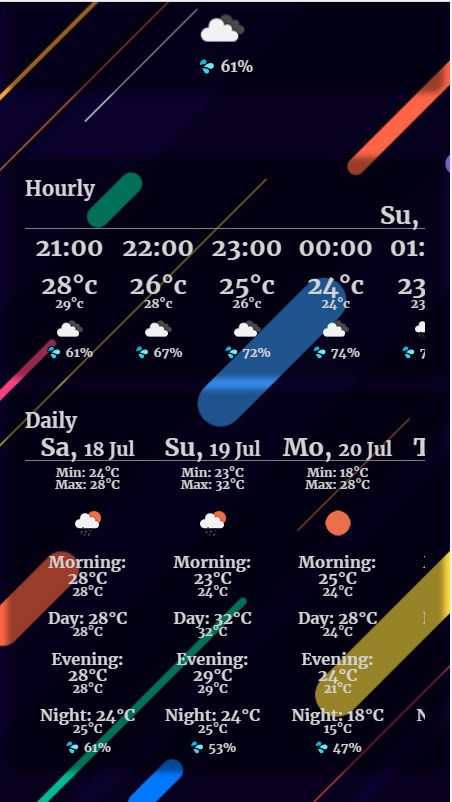
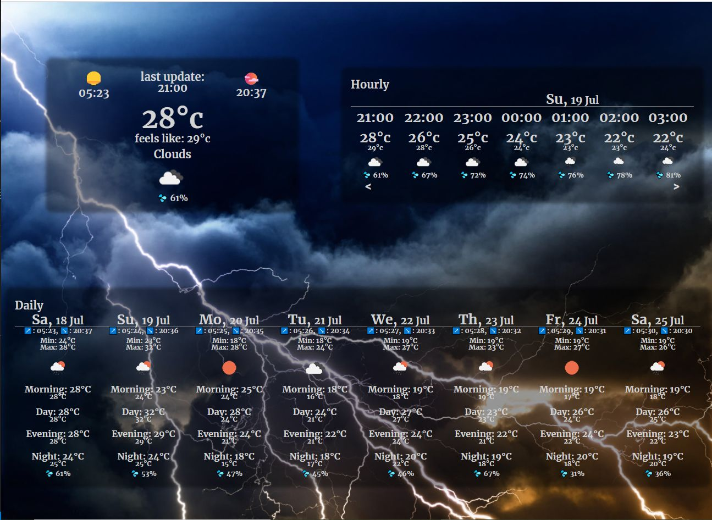

# What's the weather here?

If you want to know what's the weather like where you are, them you need not look any further!

Just open the <a href='https://whats-the-weather-like-one.vercel.app/' alt='link to app'> app </a> and get all the information you need! 

---
## Screenshots

---

### Info

This app was built using <i><b>create-react-app</b></i> <i>--template typescript</i>. if you want to run it on your machine:

<ul>
  <li>make sure you have the latest <i>yarn</i> or <i>npm</i> installed.
  <li>clone.</li>
  <li>once cloned, move to <i>client</i> in your terminal of choice and run "<b><i>yarn start</b></i>" or "<b><i>npm start</b></i>".
  <li>enjoy!</li>
</ul>